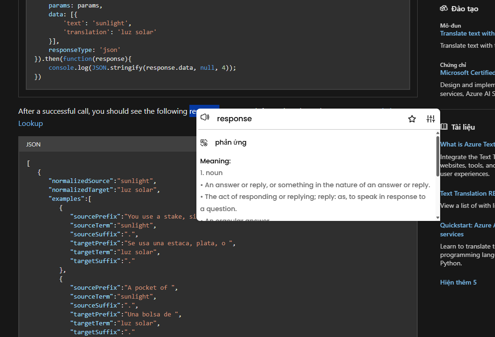
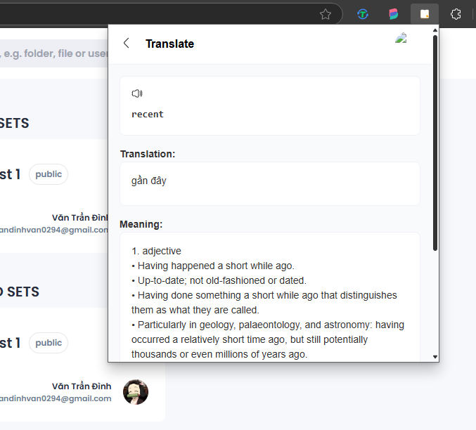
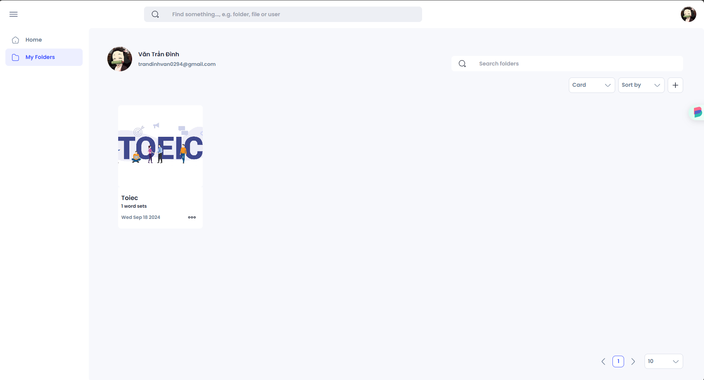
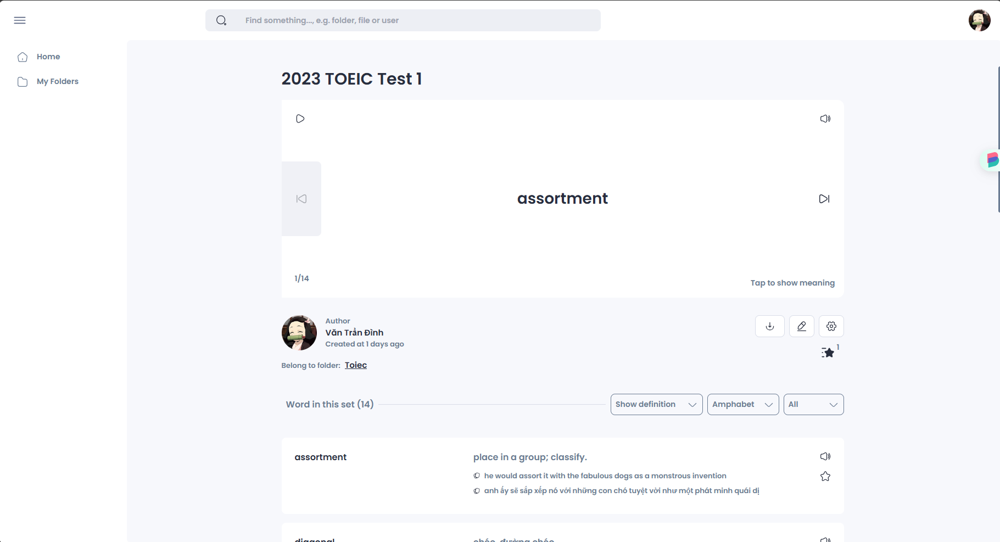
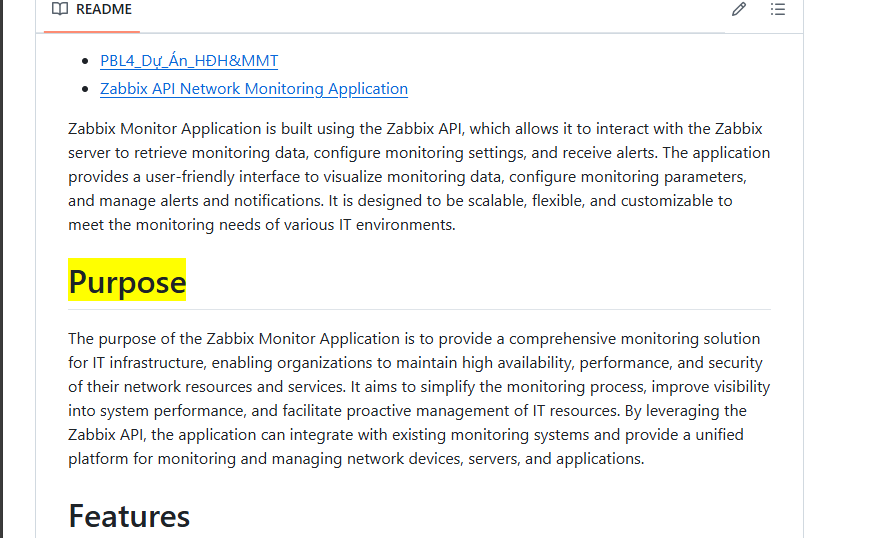
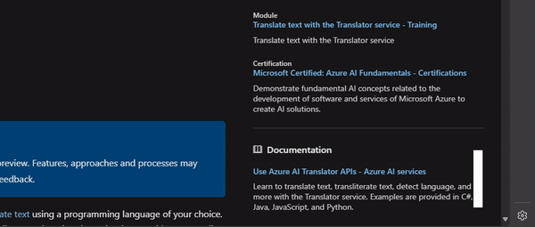

<!-- # Một công cụ hiệu quả giúp hỗ trợ học từ vựng tiếng anh trên trình duyệt -->
# An effective tool to support learning English vocabulary on the web browser

## Project Description
This project is a web extension that helps users learn English vocabulary while surfing the web. The extension will automatically look up the meaning of the selected word and display it in a pop-up immediately when the user double-clicks on the word. The extension also provides a notebook feature that allows users to save words and share them with others.

## Features
### 1. Look up the meaning of the selected word on the web page

> Translate immediately when the user double-clicks on the word.




> Translate word in the pop-up.



### 2. Save words to the notebook (coming soon)
> Notebook is a another project that is being developed. It will be integrated into this project in the future. 

> https://vocabulary-notebook-989d7.web.app/




### 3. Reminder feature (coming soon)
This feature will help users remember the words they have saved in the notebook. 

> The reminder will highlight the saved words in the web page if it appears in the content of the page.



> The reminder will also display the saved words in the pop-up automatically every certain period of time.

 

## Installation

1. Clone the repository
```bash 
git clone https://github.com/dinhvan2310/chorme-extension
```

2. Open the Extension Management page by navigating to `chrome://extensions`.
   - The Extension Management page can also be opened by clicking on the Chrome menu, hovering over `More Tools` then selecting `Extensions`.
   - Enable Developer Mode by clicking the toggle switch next to Developer mode.
   - Click the `Load unpacked` button and select the folder **public** in extension directory

3. The extension has been successfully installed. You can use it by double-clicking on any word or  on the web page.

## Tools and Technologies
- HTML, CSS, JavaScript, TypeScript, Tailwind CSS, React
- Chrome Extension API, Bing Translate API, Free Dictionary API
- Firebase (Firestore, Firebase Hosting, Firebase Authentication, Storage)
